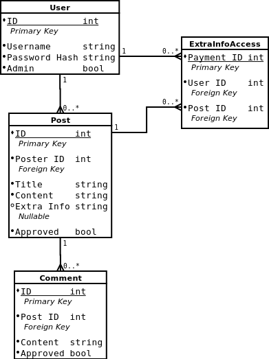

# FessUp

## Database

The database used for this project is a MySQL database with four tables: User, Post, Comment, and ExtraInfoAccess.

The schema is shown below:

### User

The user table contains user login information and whether or not the user is an admin.

Each column does the following:
* ID: unique identifier for each user, int datatype, primary key
* PasswordHash: hashed/salted/etc password for the user, string datatype
* Admin: whether the user is an admin or not, bool datatype

### Post

The post table contains information on all the posts on the site.

Each column does the following:
* ID: unique identifier for each post, int datatype, primary key
* PosterID: unique identifier of the user who created the post, int datatype, foreign key
* Title: title of the post, string datatype (255 character limit)
* Content: main body of the post, string datatype (2000 character limit)
* ExtraInfo: extra info which can be paid for, string datatype (2000 character limit)
* Approved: whether or not the post has been approved by the admins, bool datatype

### Comment

The comment table contains information on all the comments left on posts.

Each column does the following:
* ID: unique identifier for each comment, int datatype, primary key
* PostID: unique identifier for the post each comment was left on, int datatype, foreign key
* Content: main body of the comment, string datatype (2000 character limit)
* Approved: whether or not the comment has been approved by the admins, bool datatype

### ExtraInfoAccess

The extra information access table contains links users who have paid to the posts they have paid for extra information on.

Each column does the following:
* PaymentID: unique identifier for the single extra information payment, int datatype, primary key
* UserID: unique identifier for the user who made the payment, int datatype, foreign key
* PostID: unique identifier for the post who's extra information has been purchased, int datatype, foreign key

[Back](../README.md)